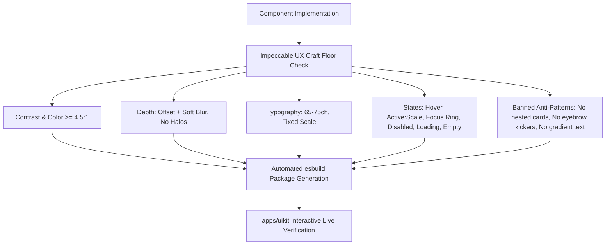

# Full ReUI Component & Block Implementation Plan for `uikit` with Impeccable UX Verification

> **Target App:** [`apps/uikit`](file:///E:/me/devops/claude-partices/demo-projects/ui-kit/apps/uikit)  
> **Source Reference:** [`reui`](file:///E:/me/devops/claude-partices/reui) — reference for content & pipeline concept only  
> **UX Craft Directive:** Impeccable Skill ([`.claude/skills/impeccable`](file:///E:/me/devops/claude-partices/.claude/skills/impeccable/SKILL.md))  
> **Dual Engine Target:** `@base-ui/react` (Base UI) + `@radix-ui/*` (Radix UI)

---

## 1. Full Inventory Matrix (72 Primitives + 21 Blocks + 5 Hooks)

> **Structure note (corrected 2026-08-15):** ui-kit is **self-contained** — it does NOT replicate reui's source layout and has **no `registry-reui/` directory** and **no dependency on reui**. Primitives/blocks/hooks are authored once in `packages/ui/src/{components,radix-components,blocks,hooks}` (single runtime source). Demo example files are **copied from reui as content** into ui-kit's own `registry/bases/<base>/{components,blocks}/<category>/c-*.tsx` + `meta.json`. We borrow only the **4-script pipeline concept** from reui (shards → esbuild category packages → static registry → verify gate). See `REUI-ECOSYSTEM-PLAN.md` §2 for the corrected tree.

### A. Core Component Primitives (72 Categories)

| # | Category | Primitive Scope / Headless Base | Impeccable UX Requirements |
|---|---|---|---|
| 1 | `accordion` | `@base-ui/react/accordion` / `@radix-ui/react-accordion` | Smooth height transition, chevron rotation, keyboard Arrow navigation, single/multi expansion |
| 2 | `alert` | HTML + ARIA live regions | Tone-based background tinting, clear icon alignment, dismiss action, no heavy left-border stripes |
| 3 | `alert-dialog` | `@base-ui/react/dialog` / `@radix-ui/react-alert-dialog` | Trapped focus, backdrop blur/tint, explicit destructive action color, ESC key dismissal |
| 4 | `aspect-ratio` | `@radix-ui/react-aspect-ratio` / CSS ratio | Fluid container scaling, image/media placeholder skeleton |
| 5 | `autocomplete` | Popover + Command / Listbox | Keyboard arrow indexing, empty search fallback, debounce support, highlighted search match |
| 6 | `avatar` | `@base-ui/react/avatar` / `@radix-ui/react-avatar` | Fallback initials, image error recovery, smooth load crossfade, avatar cluster stack support |
| 7 | `badge` | HTML + CVA variants | WCAG AA contrast on all badge variants, pill vs rounded-md, dot indicator, interactive hover tags |
| 8 | `breadcrumb` | HTML `<nav>` + ARIA current | Responsive collapse with ellipsis dropdown, icon separators, clear active page styling |
| 9 | `button` | HTML `<button>` + Slot | `:hover`, `:active:scale-[0.98]`, `:focus-visible` ring with offset, loading spinner + disabled state |
| 10 | `button-group` | Compound Buttons | Connected border radius, unified border collapse, responsive vertical wrap |
| 11 | `calendar` | Day picker / Date grid | Accessible month navigation, keyboard date selection, range selection highlights, today marker |
| 12 | `card` | HTML `<section>` | Soft offset shadow (`0 4px 20px -2px rgba(...)`), clean padding rhythm, **NO NESTED CARDS** |
| 13 | `carousel` | Embla Carousel / Framer Motion | Touch swipe gestures, keyboard arrow control, accessible slide announcer, dot/arrow controls |
| 14 | `chart` | Recharts wrapper | Tooltip portal, accessible data labels, semantic theme color tokens, responsive container |
| 15 | `checkbox` | `@base-ui/react/checkbox` / `@radix-ui/react-checkbox` | Indeterminate state support, 44x44px hit target wrapper, checkmark spring animation |
| 16 | `collapsible` | `@base-ui/react/collapsible` / `@radix-ui/react-collapsible` | Fluid height animation, auto-expand on focus |
| 17 | `combobox` | Popover + Listbox | Search input, filter list, multi-select tags, keyboard navigation |
| 18 | `command` | CMDK / Headless Command | Global `Cmd+K` dialog, fuzzy search, grouped commands, keyboard shortcuts display (`<kbd>`) |
| 19 | `context-menu` | `@radix-ui/react-context-menu` / Popover | Right-click trigger, submenu portals, keyboard accelerators, boundary collision detection |
| 20 | `data-grid` | `@tanstack/react-table` | Virtualized rows, sort headers, column resize grips, selection checkboxes |
| 21 | `date-selector` | Popover + Calendar | Quick presets (Last 7 days, MTD, YTD), dual calendar view, custom range inputs |
| 22 | `dialog` | `@base-ui/react/dialog` / `@radix-ui/react-dialog` | Modal portal, focus trap, fluid entrance animation (150ms ease-out), scroll lock |
| 23 | `drawer` | Vaul / Touch Drawer | Mobile gesture pull handle, snap points (25%, 50%, 100%), escape key dismissal |
| 24 | `dropdown-menu` | `@base-ui/react/menu` / `@radix-ui/react-dropdown-menu` | Nested submenus, item icons, shortcut badges, keyboard arrow navigation |
| 25 | `empty` | HTML + Illustration slot | Non-lazy empty states with teaching copy and clear call-to-action button |
| 26 | `event-calendar` | Multi-view calendar | Day/Week/Month grid, event pills, time indicator line, drag create |
| 27 | `field` | Form Field wrapper | Label, optional helper text, accessible error message linked with `aria-describedby` |
| 28 | `file-upload` | Drag & Drop zone + input | Dropzone active border pulse, upload progress bar, file preview, remove button |
| 29 | `filters` | Compound Query Builder | Logical operators (AND/OR), predicate selector, value picker, active filter tags |
| 30 | `frame` | Preview viewport wrapper | Responsive device frame toggle (Desktop, Tablet, Mobile), zoom control |
| 31 | `gantt` | Timeline bar grid | Task schedule bars, milestone diamonds, dependency arrow connectors, zoom controls |
| 32 | `hover-card` | `@radix-ui/react-hover-card` / Popover | Delay open/close, profile preview cards, portal escape |
| 33 | `icon-stack` | Layered avatars/badges | Overlapping cluster layout, overflow counter badge (+3), hover lift |
| 34 | `icon-tile` | Surface card with icon | Clean surface elevation, balanced icon sizing, consistent stroke weight |
| 35 | `input` | HTML `<input>` | Clearable button, prefix/suffix icons, error state styling, focus ring |
| 36 | `input-group` | Input + addon elements | Integrated leading/trailing buttons, select dropdown prefix, unified focus ring |
| 37 | `input-otp` | Input OTP component | Single-digit auto advance, paste support, numeric/alphanumeric filtering |
| 38 | `item` | List / Row container | Consistent vertical rhythm, hover background, lead icon & trailing metadata |
| 39 | `kanban` | `@dnd-kit/core` | Multi-column drag-and-drop, drag overlays, column WIP counters, card badges |
| 40 | `kbd` | HTML `<kbd>` | Monospace font only for keys, subtle border, distinct visual keycap styling |
| 41 | `label` | `@radix-ui/react-label` / HTML `<label>` | Semantic association with form controls, required asterisk styling |
| 42 | `menubar` | `@radix-ui/react-menubar` | Desktop application menubar (File, Edit, View), keyboard arrow navigation |
| 43 | `native-select` | HTML `<select>` | Clean custom chevron replacement, mobile native picker fallback |
| 44 | `navigation-menu` | `@radix-ui/react-navigation-menu` | Animated sliding indicator, mega-menu dropdowns, keyboard support |
| 45 | `number-field` | HTML input + Steppers | Increment/decrement buttons, drag scrub value support, min/max limits |
| 46 | `pagination` | HTML nav + buttons | Previous/Next buttons, active page indicator, ellipsis jump page selector |
| 47 | `phone-input` | Popover + Flag + Input | Country search dropdown, flag icons, international format masking |
| 48 | `popover` | `@base-ui/react/popover` / `@radix-ui/react-popover` | Anchored floating panel, arrow pointer, escape dismiss, collision awareness |
| 49 | `progress` | `@base-ui/react/progress` / `@radix-ui/react-progress` | Smooth width animation, indeterminate stripe pulse, accessible percentage label |
| 50 | `radio-group` | `@base-ui/react/radio` / `@radix-ui/react-radio-group` | Keyboard arrow navigation, card-radio selection variants, distinct checked indicator |
| 51 | `rating` | Star rating component | 5-star / 10-star rating, half-star hover calculation, custom glyph support |
| 52 | `resizable` | Split panes | Horizontal/vertical draggable splitter, min/max collapse thresholds |
| 53 | `scroll-area` | `@radix-ui/react-scroll-area` | Custom scrollbar track, auto-hide on idle, smooth wheel scrolling |
| 54 | `scrollspy` | IntersectionObserver / Scroll hook | Active header tracking in long documents, smooth scroll-to-section |
| 55 | `select` | `@base-ui/react/select` / `@radix-ui/react-select` | Floating options dropdown, item checkmarks, grouped option headers |
| 56 | `separator` | `@base-ui/react/separator` / `@radix-ui/react-separator` | Horizontal / vertical hairline dividers with accessible role |
| 57 | `sheet` | `@radix-ui/react-dialog` / Base Drawer | Slide-over panel (left/right/top/bottom), backdrop overlay, focus trap |
| 58 | `skeleton` | HTML placeholder block | Shimmer pulse gradient, matched typographic heights for text placeholders |
| 59 | `slider` | `@base-ui/react/slider` / `@radix-ui/react-slider` | Single / range thumb sliders, step ticks, value tooltip bubble |
| 60 | `sonner` | Sonner toast system | Stacked notifications, swipe-to-dismiss, action buttons, progress timer |
| 61 | `sortable` | `@dnd-kit/sortable` | Drag handle grips, reorder animation, accessible keyboard reorder |
| 62 | `spinner` | SVG / CSS spinner | Consistent stroke width, smooth spin rotation, accessible `Loading...` text |
| 63 | `stepper` | Stepper controller | Step number pills, completion checkmark, connecting lines, step descriptions |
| 64 | `switch` | `@base-ui/react/switch` / `@radix-ui/react-switch` | Smooth sliding thumb toggle, icon inside thumb support, disabled state |
| 65 | `table` | HTML `<table>` | Compact vs generous padding variants, striped rows, sticky headers |
| 66 | `tabs` | `@base-ui/react/tabs` / `@radix-ui/react-tabs` | Underline slider vs pill tabs, keyboard arrow switching, disabled tab state |
| 67 | `textarea` | HTML `<textarea>` | Auto-growing height option, character count indicator, clean focus ring |
| 68 | `timeline` | Vertical feed component | Connecting dotted/solid line, icon node points, timestamp metadata |
| 69 | `toggle` | `@radix-ui/react-toggle` | Pressable state button, outline/subtle variants, icon toggles |
| 70 | `toggle-group` | `@radix-ui/react-toggle-group` | Single / multiple selection group, toolbar formatting controls |
| 71 | `tooltip` | `@base-ui/react/tooltip` / `@radix-ui/react-tooltip` | Instant hover with delay, keyboard focus trigger, inverted high-contrast tone |
| 72 | `tree` | `@headless-tree/react` | Recursive branch rendering, expand/collapse chevron, folder & file icons |

---

### B. Compound Enterprise UI Blocks (21 Modules)

| Block Name | Purpose & Implementation Stack | Key UX / Visual Rules |
|---|---|---|
| `data-grid` | Full-scale TanStack Virtual Data Grid | Column toggle dropdown, sticky header, row selection, multi-facet filter bar, export menu |
| `kanban` | Dnd-kit Project Kanban Board | Swimlanes (Backlog, In Progress, Review, Done), drag card animations, task count limits |
| `gantt` | Project Timeline & Milestone Scheduler | Header date zoom (Days/Weeks/Months), draggable task bars, dependency line SVG rendering |
| `event-calendar` | Interactive Scheduling Calendar | Day/Week/Month views, appointment creation modal, time indicator, color-coded categories |
| `filters` | Advanced Query Builder | Multi-rule conditional builder (`AND`/`OR`), field type pickers (Text, Number, Date, Status) |
| `date-selector` | Dual-Month Date Range Picker | Preset chips (Today, Last 7d, Last 30d, Quarter), manual input masks, timezone offset badge |
| `autocomplete` | Async Search & Group Combobox | Loading skeleton state, highlight matches, clear button, categorized results |
| `stepper` | Multi-step Workflow Indicator | Horizontal and vertical step tracks, animated progress line, error step alert |
| `timeline` | Audit Log & Activity Feed | User avatar nodes, expandable payload diffs, status pills, date separators |
| `tree` | Hierarchical File & Asset Tree | Drag-to-move items, async lazy node fetching, inline item rename, multi-select |
| `sortable` | Drag-to-reorder List & Grid | Grip handles, item lift shadow, keyboard reordering with Space + Arrow keys |
| `number-field` | Numeric Stepper & Scrubber | Scrub cursor icon, min/max clamping, currency/percentage formatting |
| `phone-input` | Country Phone Picker | Flag icon previews, dial code search, formatted input masking |
| `rating` | Interactive Star Rating | Half-star hover states, numeric score badge, review comment trigger |
| `frame` | Responsive Preview Frame | Viewport switchers (375px, 768px, 1280px), zoom scale control, dark/light toggle |
| `icon-stack` | Avatar & Badge Overlap Cluster | Overlapping negative margins, border ring separation, "+N" overflow badge |
| `icon-tile` | Metric & Category Feature Tiles | Clean surface elevation, balanced typography, no nested card clutter |
| `scrollspy` | Document Section Tracker | Intersection Observer tracking, active item highlight, smooth scrolling |
| `badge` | Status & Pill Compound Variants | Pulse dot indicators, counter tags, removable badge dismiss buttons |
| `alert` | Rich Notification Callouts | Accent-tinted backgrounds, icon integration, multi-action buttons |

---

### C. Shared Headless Interaction Hooks (5 Hooks)

1. **`use-file-upload.ts`**: Drag-over tracking, file validation (size, MIME type), thumbnail generation.
2. **`use-slider-input.ts`**: Bi-directional sync between range slider and numeric input.
3. **`use-scroll-position.ts`**: Throttled window/container scroll tracking for headers and scrollspy.
4. **`use-copy-to-clipboard.ts`**: Copy action state, feedback timeout timer, error handling.
5. **`use-stepper.ts`**: Step navigation state, validation gatekeeper, history traversal.

---

## 2. Impeccable UX/UI Craft Verification Framework

All 72 primitives and 21 blocks will be verified against the **Impeccable Craft Floor** ([`reference/craft-floor.md`](file:///E:/me/devops/claude-partices/.claude/skills/impeccable/reference/craft-floor.md)):

### Verification Checklist per Component:
- [ ] **Contrast Compliance**: Normal text $\ge 4.5:1$, large text $\ge 3:1$ across Light & Dark themes.
- [ ] **Interactive States**: Every clickable control includes `:hover`, `:active:scale-[0.98]`, `:focus-visible:ring-2`, `:disabled:opacity-50`, and skeleton loading state.
- [ ] **Motion Standards**: Transitions strictly within $150\text{--}250\text{ ms}$ ease-out; no lingering animation delays.
- [ ] **Zero Container Slop**: No card inside card inside card; use semantic borders, dividers, or subtle background tone changes.
- [ ] **Touch Target Accessibility**: Minimum interactive bounding box of $44 \times 44\text{ px}$ on mobile viewports.
- [ ] **Keyboard Navigation**: Complete tab order, arrow key navigation in listboxes/menus/tabs, and ESC key dismissal on modals/drawers/popovers.

---

## 3. Execution Roadmap

1. **Sprint 1**: Build the esbuild package generator + registry pipeline in `packages/registry-builder/` (4 scripts: `build-components`, `build-component-packages`, `build-registry`, `verify-registry`) and configure dual-engine packages (`@ui-kit/components-base-*` & `@ui-kit/components-radix-*`).
2. **Sprint 2**: Implement core forms and overlays (Input, Select, Dialog, Popover, Dropdown, Checkbox, Radio, Slider, Switch, Autocomplete).
3. **Sprint 3**: Implement navigation, feedback, and data display (Tabs, Accordion, Breadcrumb, Table, Badge, Alert, Sonner, Tree, Stepper).
4. **Sprint 4**: Implement high-order UI blocks (Data Grid, Kanban, Gantt, Event Calendar, Filter Query Builder, Date Selector).
5. **Sprint 5**: Impeccable Craft Floor audit across light/dark themes and responsive breakpoints (375px, 768px, 1440px).
